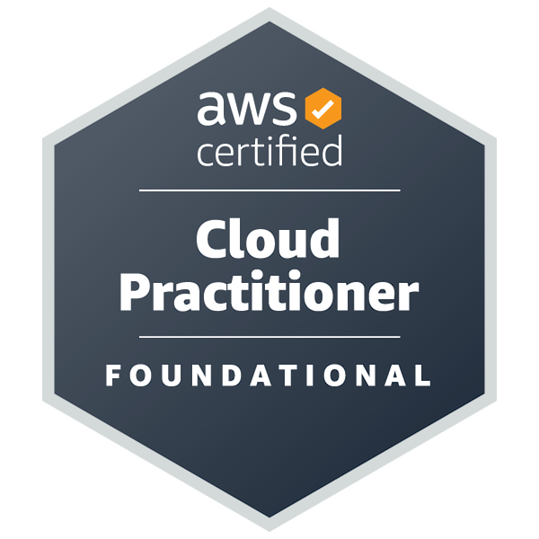

# Olá, me chamo André Mattos! 👋

  

---

Sou Desenvolvedor FullStack com forte especialização em **Back-end, Cloud AWS e DevOps**.
Atuo desenvolvendo APIs, aplicações web e soluções com IA, sempre aplicando boas práticas, arquitetura limpa e visão de produto.

---

# 🚀 Stack Principal

## 💻 Back-end

## 🎨 Front-end

## ☁️ Cloud & DevOps

---

# ☁️ Certificações AWS

&nbsp;&nbsp;&nbsp;

&nbsp;&nbsp;&nbsp;

---

# 🌟 Projetos em Destaque

## 🔎 Email Analyzer  
Sistema inteligente de classificação de emails corporativos utilizando OpenAI, FastAPI e Docker, com deploy em Cloud AWS.

🔗 Repositório:  

🌐 Aplicação:  

## 🏥 LABMedical  
Sistema FullStack com API REST em Java + Spring Boot, autenticação JWT, PostgreSQL e front-end Angular.

🔗 Back-end:  

🔗 Front-end:  

## 🎵 Music Box  
Aplicação web interativa focada em manipulação de DOM e lógica em JavaScript.

🔗 Repositório:  

---

# 🎓 Formação & Especializações

---

## 🎓 Análise e Desenvolvimento de Sistemas  
**GRAN**  
📅 out/2025 – abr/2028 (em andamento)

Curso Superior de Tecnologia voltado ao desenvolvimento de competências em análise, projeto, implementação e manutenção de sistemas de informação.

**Principais tópicos:**
- Fundamentos de programação  
- Engenharia de software  
- Banco de dados  
- Desenvolvimento web  
- Segurança da informação  
- Computação em nuvem  
- Atuação em equipes multidisciplinares e ambientes ágeis  

---

## 🚀 Bootcamp DevOps – Atlântico Avanti  
📅 2026

Formação prática com foco em cultura DevOps, automação e entrega contínua.

**Principais tópicos:**
- Linux e Infraestrutura como Código  
- Docker e Kubernetes  
- CI/CD com GitLab  
- Cultura DevOps e automação  

---

## 💻 Desenvolvimento FullStack – LAB365 (SENAI/SC)  
📅 900 horas

Programa intensivo com foco em desenvolvimento web completo e projetos reais.

**Principais tópicos:**
- Java + Spring Boot  
- Angular  
- APIs REST  
- PostgreSQL  
- Metodologias ágeis  

---

## ☕ Formação Back-end – Oracle Next Education (ONE)  
📅 560 horas

Formação focada em desenvolvimento Back-end com Java.

**Principais tópicos:**
- Java  
- Spring Framework  
- SQL  
- SOLID e Clean Code  
- Versionamento com Git  

---

## ☁️ AWS re/Start – Escola da Nuvem  
📅 mar/2025 – set/2025

Programa intensivo em computação em nuvem e fundamentos de Inteligência Artificial.

**Principais tópicos:**
- Serviços AWS (EC2, S3, IAM, VPC)  
- Linux  
- Automação com Python  
- Introdução à IA na AWS  

---

# 📫 Contato

  
  
  

